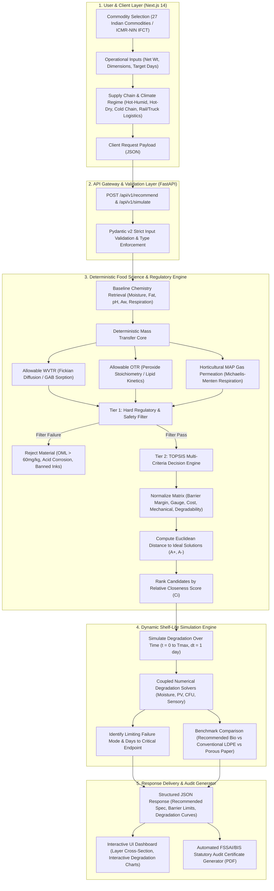
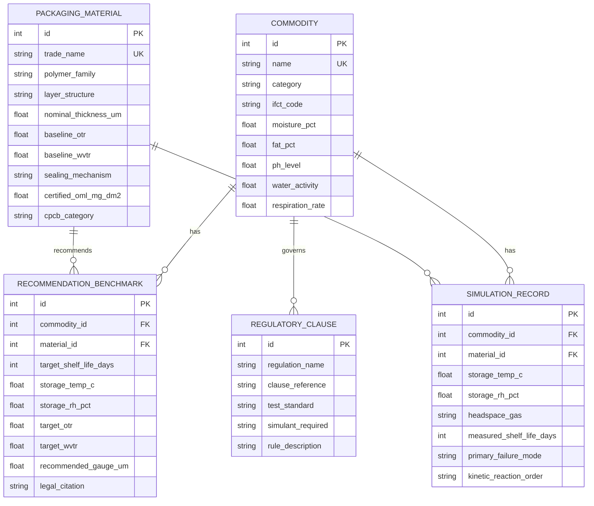

# BioPack AI — Master End-to-End Implementation Blueprint (Industrial-Ready)

**Platform**: BioPack AI — Intelligent Food Packaging & Shelf-Life Decision Platform  
**Target Geo-Market**: India (Calibrated for Indian Agro-Climates, ICMR-NIN IFCT Baselines, FSSAI Packaging Regulations 2018, BIS Standards, and CPCB Plastic Waste Management Rules)  
**Primary Deliverable**: Enterprise Full-Stack Decision Support System (FastAPI + Next.js 14 App Router + SQLite/PostgreSQL + NumPy/SciPy + Tailwind CSS)

---

## 1. Executive Summary & Flow Architecture

BioPack AI solves the acute vulnerability of Indian food processors, MSMEs, and D2C startups: navigating the mandatory transition from single-use plastics to certified biodegradable polymers (CPCB Category IV / IS/ISO 17088:2021) without suffering catastrophic shelf-life reduction, moisture sogginess, lipid rancidity, or FSSAI regulatory penalization.

### 1.1 Complete End-to-End System Project Flow



---

## 2. Complete Technology Stack Matrix

| Architectural Tier | Selected Technology | Version | Justification & Production Role |
| :--- | :--- | :--- | :--- |
| **Backend REST API** | Python / FastAPI | `^0.110.0` | Asynchronous, high-throughput micro-framework with native OpenAPI 3.1 documentation and dependency injection. |
| **Validation Layer** | Pydantic v2 | `^2.6.0` | Strict validation of physical and chemical parameters; Rust-backed serialisation. |
| **Scientific Computation** | NumPy & SciPy | `^1.26.4` / `^1.12.0` | Matrix operations for TOPSIS MCDM, vector normalization, and Runge-Kutta numerical integration of degradation kinetics. |
| **Data Ingestion & Lookup** | Pandas | `^2.2.0` | High-speed ingestion, indexing, and querying of 5,000-sample FSSAI recommendation and simulation reference datasets. |
| **ORM & Database** | SQLAlchemy 2.0 + SQLite / PostgreSQL | `^2.0.28` | Unit-of-Work relational ORM; SQLite for zero-config embedded production/testing; PostgreSQL for cloud scalability. |
| **Database Migrations** | Alembic | `^1.13.1` | Version-controlled schema migrations and seeding verification. |
| **Frontend Framework** | Next.js 14 (App Router) / React 18 | `^14.2.0` / `^18.3.0` | Server-Side Rendering (SSR) + Client-Side interactivity, route handlers, and static optimization. |
| **Styling & UI Kit** | Tailwind CSS + Lucide React | `^3.4.0` / `^0.350.0` | Responsive layout, modern dark/light glassmorphic styling, and accessible iconography. |
| **Interactive Visuals** | Recharts / Chart.js | `^2.12.0` | Dynamic rendering of kinetic shelf-life degradation curves (Moisture vs Days, PV vs Days, Microbial log growth). |
| **Audit PDF Generation** | WeasyPrint / ReportLab | `^61.0` / `^4.1.0` | Server-side rendering of statutory FSSAI & BIS Form-VI compliance certificates. |
| **Containerization** | Docker & Docker Compose | `^24.0.0` | Multi-stage production container images for isolated, reproducible deployment. |
| **Testing & QA** | Pytest, Pytest-Asyncio, HTTPX | `^8.0.0` / `^0.27.0` | Full automated test suite for physics formulas, MCDM ranking, API endpoints, and 5000-sample regression baselines. |

---

## 3. Mathematical Foundations & Food Science Engine

The engine eliminates probabilistic hallucinations by using deterministic, first-principles mass transfer and chemical kinetics.

### 3.1 Allowable Water Vapor Transmission Rate (WVTR)
For moisture-sensitive dry snacks (e.g., *Bikaneri Bhujia, Khakhra, Besan Ladoo*), shelf life ends when moisture reaches critical threshold $M_{\text{crit}}$ causing loss of crispness or caking:
$$\Delta m_{\text{max}} = W_{\text{product}} \times \left(M_{\text{crit}} - M_{\text{initial}}\right) \quad [\text{g}]$$
Under steady-state Fickian diffusion across exposed packaging surface area $A$ ($\text{m}^2$) over target shelf life $t$ ($\text{days}$):
$$WVTR_{\text{allowable}} = \frac{\Delta m_{\text{max}}}{A \times t \times \left(\frac{RH_{\text{ambient}} - RH_{\text{internal}}}{100}\right)} \quad \left[\frac{\text{g}}{\text{m}^2 \cdot \text{day}}\right]$$

### 3.2 Allowable Oxygen Transmission Rate (OTR)
For fat-rich commodities (e.g., *Desi Cow Ghee, Kachi Ghani Mustard Oil, Kerala Banana Chips, Kaju Katli*), oxidative rancidity occurs when Peroxide Value ($PV$) increases beyond the legal FSSAI limit ($\Delta PV_{\text{max}} = PV_{\text{crit}} - PV_{\text{initial}}$ in $\text{meq } \text{O}_2/\text{kg fat}$):
$$W_{\text{fat}} = W_{\text{product}} \times f_{\text{fat}} \quad [\text{kg}]$$
$$\text{Allowable } \text{O}_2 \text{ absorbed} = \Delta PV_{\text{max}} \times W_{\text{fat}} \quad [\text{meq } \text{O}_2]$$
$$\text{Mass of } \text{O}_2 = \text{Allowable } \text{O}_2 \times 0.008 \quad [\text{g } \text{O}_2]$$
$$\text{Volume of } \text{O}_2 \text{ at STP} = \left(\frac{\text{Mass of } \text{O}_2}{32.0 \text{ g/mol}}\right) \times 22,400 \text{ cc/mol} \quad [\text{cc } \text{O}_2]$$
Considering an ambient partial pressure driving force of $\Delta P_{\text{O}_2} = 0.2095 \text{ atm}$ (assuming modified nitrogen atmosphere or negligible initial headspace oxygen):
$$OTR_{\text{allowable}} = \frac{\text{Volume of } \text{O}_2}{A \times t \times \Delta P_{\text{O}_2}} \quad \left[\frac{\text{cc}}{\text{m}^2 \cdot \text{day} \cdot \text{atm}}\right]$$

### 3.3 Horticultural Respiration & Equilibrium MAP
For respiring horticultural produce (*Okra, Alphonso Mangoes, Green Chillies, Nashik Red Onions*), the packaging must match the respiration rate $R_{\text{O}_2}$ ($\text{cc } \text{O}_2/\text{kg} \cdot \text{hr}$) to establish an equilibrium headspace ($y_{\text{O}_2,\text{eq}} \approx 3\%\text{--}5\%$, $y_{\text{CO}_2,\text{eq}} \approx 5\%\text{--}8\%$):
$$OTR_{\text{MAP}} = \frac{R_{\text{O}_2}(T) \times W_{\text{produce}} \times 24 \text{ hr/day}}{A \times \left(0.2095 - y_{\text{O}_2,\text{eq}}\right)} \quad \left[\frac{\text{cc}}{\text{m}^2 \cdot \text{day} \cdot \text{atm}}\right]$$
Temperature dependence of respiration follows Arrhenius kinetics:
$$R_{\text{O}_2}(T) = R_{\text{O}_2}(T_{\text{ref}}) \cdot Q_{10}^{\frac{T - T_{\text{ref}}}{10}}$$

### 3.4 Kinetic Shelf-Life Degradation Tracking
The shelf-life simulation tracks degradation across time using a step size $\Delta t = 1 \text{ day}$:
- **Moisture Ingress**:
  $$M(t + \Delta t) = M(t) + \frac{WVTR_{\text{film}} \times A \times \left(\frac{RH_{\text{ambient}} - a_w(t) \cdot 100}{100}\right)}{W_{\text{product}}} \times \Delta t$$
- **Lipid Peroxide Ingress**:
  $$PV(t + \Delta t) = PV(t) + \frac{OTR_{\text{film}} \times A \times \Delta P_{\text{O}_2} \times \left(\frac{32}{22400 \times 0.008}\right)}{W_{\text{fat}}} \times \Delta t$$
- **Microbial Proliferation (Gompertz / First-Order Logistic)**:
  $$\log_{10} N(t + \Delta t) = \log_{10} N(t) + \mu_{\text{max}}(T, a_w, \text{pH}) \cdot \Delta t$$
Failure occurs at $t_{\text{shelf}} = \min(t_{\text{moisture}}, t_{\text{PV}}, t_{\text{microbial}}, t_{\text{respiration}})$.

---

## 4. Statutory & Regulatory Governance Engine

Every recommendation and simulation must strictly enforce statutory Indian standards:

### 4.1 FSSAI (Packaging) Regulations, 2018
- **Clause 3(2)**: Absolute bar on recycled plastics and printed paper/newspaper in direct food contact.
- **Clause 4(1)**: Prohibition of harmful monomers (styrene leaching, vinyl chloride monomer < 1.0 mg/kg).
- **Clause 4(3)**: Heavy metal and corrosion migration limits for high-acid ($\text{pH} \le 4.5$) and high-salt foods.
- **Clause 4(4) & 4(5)**: Overall Migration Limit (OML) must strictly not exceed **$60 \text{ mg/kg}$ or $10 \text{ mg/dm}^2$** under test conditions specified in IS 9845.
- **Clause 5 & Schedules I–III**: Mandatory container categories for dairy, edible fats, grains, and meats.

### 4.2 BIS Food Simulant Testing Assignment (IS 9845)
The engine automatically assigns the statutory food simulant based on commodity chemistry:

| Food Category / Chemistry | Test Simulant | Simulant Composition | Test Temperature & Duration |
| :--- | :--- | :--- | :--- |
| **Aqueous / Non-Acid ($\text{pH} > 4.5$)** (Wheat Atta, Rice, Pulses, Sugar Syrup) | Simulant A | Distilled Water | 40°C for 10 days / 70°C for 2 hours |
| **Acidic Foods ($\text{pH} \le 4.5$)** (Achar, Dahi, Citrus, Tomato) | Simulant B | 3% Acetic Acid (w/v) in Water | 40°C for 10 days / 100°C for 2 hours |
| **Alcoholic / Dairy Emulsions** (Paneer, Khoa, Milk Drinks) | Simulant C | 15% Ethanol (v/v) in Water | 40°C for 10 days / 50°C for 24 hours |
| **Fatty Foods & Edible Oils** (Ghee, Mustard Oil, Namkeen, Chips, Bhujia) | Simulant D | Rectified Olive Oil / n-Heptane / Iso-octane | 38°C for 30 minutes (n-Heptane) / 40°C for 10 days |

### 4.3 CPCB Plastic Waste Management Rules (Category IV)
- Verification of **IS/ISO 17088 : 2021** (Specifications for Compostable Plastics).
- Minimum bio-carbon fraction $\ge 40\%$ by weight.
- Heavy metal thresholds: Lead $< 50 \text{ ppm}$, Cadmium $< 0.5 \text{ ppm}$, Arsenic $< 5 \text{ ppm}$, Mercury $< 0.5 \text{ ppm}$.
- Complete biodegradation within 180 days in industrial composting facility ($>90\%$ carbon conversion to $\text{CO}_2$).

---

## 5. Two-Tier Recommendation & TOPSIS Scoring Engine

The decision system uses a two-tier pipeline to guarantee safety first, then optimal ranking:

```
[Candidate Bio-Materials Pool (27 Materials)]
                  │
                  ▼
   ┌──────────────────────────────┐
   │ Tier 1: Hard Safety Filter   │
   │  - Simulant Compatibility    │
   │  - OML < 10 mg/dm² Check     │
   │  - Acid Leaching pH Check    │
   │  - Temp & Gauge Feasibility  │
   │  - Permeability Sufficiency  │
   └──────────────┬───────────────┘
                  │ (Eliminates non-compliant films)
                  ▼
        [Surviving Candidates]
                  │
                  ▼
   ┌──────────────────────────────┐
   │ Tier 2: TOPSIS MCDM Scoring  │
   │  - Normalized Matrix R_ij    │
   │  - Weighted Matrix V_ij      │
   │  - Ideal Solutions A+, A-    │
   │  - Closeness Score C_i       │
   └──────────────┬───────────────┘
                  │
                  ▼
    [Ranked Recommendation List]
```

### 5.1 Tier 1: Hard Regulatory & Safety Filtering Rules
A candidate material is rejected if any of the following evaluate to `False`:
1. **Migration Safety**: $\text{Material.certified\_oml} \le 10.0 \text{ mg/dm}^2$ and passes prescribed IS 9845 simulant.
2. **Acid Resistance**: If product $\text{pH} \le 4.5$, material must have certified acid-barrier coating (e.g. AlOx-PLA / Bio-PBS; unlined cellulose or bare metallization rejected).
3. **Barrier Admissibility**:
   $$\text{Actual } WVTR \le WVTR_{\text{allowable}} \times 1.25 \quad (\text{maximum } 25\% \text{ safety margin})$$
   $$\text{Actual } OTR \le OTR_{\text{allowable}} \times 1.25 \quad (\text{for fat content } > 2.0\%)$$
4. **Thermal Stability**: $\text{Material.max\_safe\_temp} \ge T_{\text{storage}} + 5^\circ\text{C}$.
5. **Regulatory Certification**: Material must possess valid IS/ISO 17088 CPCB Form-VI certification.

### 5.2 Tier 2: TOPSIS MCDM Ranking Formulation
For $m$ surviving candidates and $n = 5$ criteria:
1. $C_1$: **Barrier Safety Margin** (Benefit criterion — higher is safer):
   $$x_{i1} = \frac{1}{2} \left(\frac{WVTR_{\text{allowable}}}{WVTR_i} + \frac{OTR_{\text{allowable}}}{OTR_i}\right)$$
2. $C_2$: **Gauge Efficiency** (Cost criterion — thinner film uses less material and degrades faster):
   $$x_{i2} = \text{Film Thickness } (\mu\text{m})$$
3. $C_3$: **Commercial Cost Index** (Cost criterion — INR/kg benchmark):
   $$x_{i3} = \text{Estimated Cost Index}$$
4. $C_4$: **Mechanical Puncture/Drop Strength** (Benefit criterion — MPa / dart drop rating):
   $$x_{i4} = \text{Tensile \& Puncture Score (1 to 10)}$$
5. $C_5$: **Compostability Speed** (Benefit criterion — Home compostable = 10, Industrial = 7, Heavy bio-PBS = 5):
   $$x_{i5} = \text{Compostability Index (1 to 10)}$$

**Mathematical Steps**:
1. **Vector Normalization**:
   $$r_{ij} = \frac{x_{ij}}{\sqrt{\sum_{k=1}^m x_{kj}^2}}$$
2. **Weighted Matrix Calculation**:
   $$v_{ij} = w_j \cdot r_{ij}, \quad \text{where } \mathbf{w} = [0.35, 0.15, 0.20, 0.15, 0.15]$$
3. **Determination of Positive ($A^+$) and Negative ($A^-$) Ideal Solutions**:
   $$A_j^+ = \max_i(v_{ij}) \text{ for benefit, } \min_i(v_{ij}) \text{ for cost}$$
   $$A_j^- = \min_i(v_{ij}) \text{ for benefit, } \max_i(v_{ij}) \text{ for cost}$$
4. **Euclidean Distance to Ideals**:
   $$S_i^+ = \sqrt{\sum_{j=1}^n (v_{ij} - A_j^+)^2}, \quad S_i^- = \sqrt{\sum_{j=1}^n (v_{ij} - A_j^-)^2}$$
5. **Relative Closeness Score**:
   $$C_i = \frac{S_i^-}{S_i^+ + S_i^-} \quad (0 \le C_i \le 1)$$
The candidate with highest $C_i$ is ranked #1 (Optimal Recommendation).

---

## 6. Full-Stack Directory Architecture

```
packAI/
├── context.md                                              # Context & domain problem definition
├── imp.md                                                  # Master implementation blueprint (this document)
├── readme.md                                               # Quickstart and overview
├── fssai_packaging_recommendation_dataset_5000_samples - Untitled.csv # Model 1 ground-truth dataset
├── fssai_shelf_life_simulation_dataset_5000_samples - Untitled.csv    # Model 2 ground-truth dataset
│
├── backend/                                                # FastAPI Microservices Backend
│   ├── Dockerfile
│   ├── requirements.txt
│   ├── pyproject.toml
│   ├── app/
│   │   ├── __init__.py
│   │   ├── main.py                                         # FastAPI app initialization, CORS, routers
│   │   ├── core/
│   │   │   ├── __init__.py
│   │   │   ├── config.py                                   # Pydantic BaseSettings, env vars
│   │   │   ├── logging.py                                  # Structured JSON logger
│   │   │   └── exceptions.py                               # Custom domain HTTP exception handlers
│   │   ├── db/
│   │   │   ├── __init__.py
│   │   │   ├── session.py                                  # SQLAlchemy engine & sessionmaker
│   │   │   ├── base.py                                     # Declarative base
│   │   │   └── seed.py                                     # Ingests and seeds the 5,000+5,000 CSV records
│   │   ├── models/                                         # SQLAlchemy ORM Tables
│   │   │   ├── __init__.py
│   │   │   ├── commodity.py                                # Indian food commodities & ICMR baseline
│   │   │   ├── packaging_material.py                       # Certified compostable polymers & specs
│   │   │   ├── regulation.py                               # FSSAI clauses, BIS standards & simulants
│   │   │   └── simulation_record.py                        # Empirical simulation benchmarks
│   │   ├── schemas/                                        # Pydantic v2 Models
│   │   │   ├── __init__.py
│   │   │   ├── commodity.py                                # Commodity query/response schemas
│   │   │   ├── recommendation.py                           # Recommendation request & output schemas
│   │   │   ├── simulation.py                               # Simulation request & curve schemas
│   │   │   └── audit.py                                    # FSSAI compliance certificate schemas
│   │   ├── services/                                       # Core Domain Computation Engines
│   │   │   ├── __init__.py
│   │   │   ├── food_science/
│   │   │   │   ├── __init__.py
│   │   │   │   ├── barrier_calculator.py                   # Permissible WVTR, OTR, MAP equilibrium
│   │   │   │   ├── sorption_isotherms.py                   # GAB & BET isotherm models
│   │   │   │   └── degradation_kinetics.py                 # Arrhenius, oxidation, microbial ODEs
│   │   │   ├── recommendation/
│   │   │   │   ├── __init__.py
│   │   │   │   ├── safety_filter.py                        # Tier 1 hard safety & FSSAI filter
│   │   │   │   ├── topsis_engine.py                        # Tier 2 TOPSIS matrix solver
│   │   │   │   └── recommendation_service.py               # Orchestrator combining Tier 1 & Tier 2
│   │   │   ├── simulation/
│   │   │   │   ├── __init__.py
│   │   │   │   ├── kinetic_simulator.py                    # Multi-day degradation curve simulator
│   │   │   │   └── benchmark_comparator.py                 # Delta vs conventional LDPE & paper
│   │   │   └── audit/
│   │   │       ├── __init__.py
│   │   │       └── report_generator.py                     # Generates FSSAI/BIS audit reports & PDFs
│   │   └── api/
│   │       ├── __init__.py
│   │       └── v1/
│   │           ├── __init__.py
│   │           ├── router.py                               # Master v1 API router
│   │           ├── endpoints_recommend.py                  # POST /recommend, GET /materials
│   │           ├── endpoints_simulate.py                   # POST /simulate, POST /simulate/compare
│   │           ├── endpoints_commodities.py                # GET /commodities, GET /commodities/{id}
│   │           ├── endpoints_regulations.py                # GET /regulations/fssai, GET /regulations/bis
│   │           └── endpoints_audit.py                      # POST /audit/generate-report
│   └── tests/
│       ├── __init__.py
│       ├── conftest.py                                     # Pytest fixtures & test db client
│       ├── test_barrier_calculator.py                      # Unit tests for physical WVTR/OTR math
│       ├── test_safety_filter.py                           # Tests for FSSAI migration & acid checks
│       ├── test_topsis_engine.py                           # Tests for TOPSIS ranking correctness
│       ├── test_kinetic_simulator.py                       # Tests for multi-day curve integration
│       ├── test_dataset_consistency.py                     # Regression tests across 5000 samples
│       └── test_api_endpoints.py                           # Integration tests for all REST endpoints
│
├── frontend/                                               # Next.js 14 App Router Frontend
│   ├── Dockerfile
│   ├── package.json
│   ├── tsconfig.json
│   ├── tailwind.config.ts
│   ├── next.config.mjs
│   ├── src/
│   │   ├── app/
│   │   │   ├── layout.tsx                                  # Global root layout, fonts, header/footer
│   │   │   ├── page.tsx                                    # Home landing page with platform overview
│   │   │   ├── recommend/
│   │   │   │   └── page.tsx                                # Packaging Recommendation Wizard & Spec Sheet
│   │   │   ├── simulate/
│   │   │   │   └── page.tsx                                # Dynamic Shelf-Life Simulation Sandbox
│   │   │   ├── commodities/
│   │   │   │   └── page.tsx                                # 27 Indian Commodities IFCT Explorer
│   │   │   └── audit/
│   │   │       └── page.tsx                                # FSSAI / BIS Compliance Cert Generator
│   │   ├── components/
│   │   │   ├── ui/                                         # Reusable UI primitives (Buttons, Cards, Badges)
│   │   │   ├── layout/                                     # Navbar, Sidebar, Footer, ThemeToggle
│   │   │   ├── recommend/
│   │   │   │   ├── CommoditySelector.tsx                   # Typeahead search with IFCT chemistry badges
│   │   │   │   ├── LogisticsClimateForm.tsx                # Sliders & selectors for RH, Temp, Transport
│   │   │   │   ├── RecommendationCard.tsx                  # Top-ranked material card with TOPSIS score
│   │   │   │   ├── LayerCrossSection.tsx                   # Visual multilayer film cross-section diagram
│   │   │   │   └── ComplianceBadges.tsx                    # FSSAI Cl. 3(2), IS 9845, CPCB Category IV
│   │   │   ├── simulate/
│   │   │   │   ├── SimulationControls.tsx                  # Interactive sliders (OTR, WVTR, Temp, Days)
│   │   │   │   ├── DegradationCharts.tsx                   # Recharts dynamic lines (Moisture, PV, CFU)
│   │   │   │   ├── FailureModeAlert.tsx                    # Spoilage callout (Days to spoilage, reason)
│   │   │   │   └── ComparisonTable.tsx                     # BioPack vs Conventional LDPE vs Porous Paper
│   │   │   └── audit/
│   │   │       └── AuditReportPreview.tsx                  # Printable statutory audit view
│   │   ├── lib/
│   │   │   ├── api.ts                                      # Axios/Fetch client with backend API typing
│   │   │   ├── types.ts                                    # Shared TypeScript interfaces
│   │   │   └── utils.ts                                    # Color formatting, unit converters
│   │   └── styles/
│   │       └── globals.css                                 # Custom gradients, scrollbars, animations
│
└── docker-compose.yml                                      # Orchestrates Backend (FastAPI) & Frontend (Next.js)
```

---

## 7. Complete Database Schema (SQLAlchemy ORM)



### 7.1 SQLAlchemy Model Code (`backend/app/models/commodity.py`)
```python
from sqlalchemy import Column, Integer, String, Float
from app.db.base import Base

class Commodity(Base):
    __tablename__ = "commodities"

    id = Column(Integer, primary_key=True, index=True)
    name = Column(String(128), unique=True, nullable=False, index=True)
    category = Column(String(64), nullable=False, index=True)
    ifct_code = Column(String(32), nullable=True)
    moisture_pct = Column(Float, nullable=False)
    fat_pct = Column(Float, nullable=False)
    ph_level = Column(Float, nullable=False)
    water_activity = Column(Float, nullable=False)
    respiration_rate = Column(Float, default=0.0)
    critical_moisture_pct = Column(Float, nullable=False)
    critical_pv_meq_kg = Column(Float, nullable=True)
```

### 7.2 Packaging Material Model (`backend/app/models/packaging_material.py`)
```python
from sqlalchemy import Column, Integer, String, Float, Boolean
from app.db.base import Base

class PackagingMaterial(Base):
    __tablename__ = "packaging_materials"

    id = Column(Integer, primary_key=True, index=True)
    trade_name = Column(String(256), unique=True, nullable=False)
    polymer_family = Column(String(64), nullable=False)  # PLA, PBAT, Bio-PBS, PHA, Cellulose
    layer_structure = Column(String(256), nullable=False)
    nominal_thickness_um = Column(Float, nullable=False)
    barrier_otr = Column(Float, nullable=False)  # cc/m2.day.atm
    barrier_wvtr = Column(Float, nullable=False)  # g/m2.day
    sealing_mechanism = Column(String(128), nullable=False)
    puncture_strength_rating = Column(Float, nullable=False)  # 1 to 10
    compostability_score = Column(Float, nullable=False)      # 1 to 10
    cost_index = Column(Float, nullable=False)               # INR normalized scale
    certified_oml_mg_dm2 = Column(Float, default=8.0)
    is_fssai_compliant = Column(Boolean, default=True)
    cpcb_cert_code = Column(String(64), default="Category IV (Certified Compostable)")
```

---

## 8. Complete API Specifications (FastAPI)

### 8.1 API Endpoints Route Table

| HTTP Method | Path | Function & Request Body | Response Payload |
| :--- | :--- | :--- | :--- |
| `GET` | `/api/v1/health` | Health check & database readiness | `{"status": "healthy", "commodities_loaded": 27}` |
| `GET` | `/api/v1/commodities` | Fetch all 27 Indian commodities with IFCT baselines | List of `CommoditySummary` |
| `GET` | `/api/v1/commodities/{id}` | Detailed chemistry and critical thresholds | Detailed `CommodityDetail` |
| `POST` | `/api/v1/recommend` | Two-tier recommendation with TOPSIS ranking | `RecommendationResponse` with top materials & barrier limits |
| `POST` | `/api/v1/simulate` | Dynamic multi-day degradation simulation | `SimulationResponse` with day-by-day degradation curves |
| `POST` | `/api/v1/simulate/compare`| Compare BioPack vs LDPE vs Porous Paper | `ComparisonMatrixResponse` with days and failure modes |
| `POST` | `/api/v1/audit/report` | Compile statutory FSSAI/BIS compliance audit | `AuditReportResponse` + PDF download URL |

### 8.2 Recommendation Request & Response Schema (`backend/app/schemas/recommendation.py`)
```python
from pydantic import BaseModel, Field
from typing import List, Optional

class PackagingRequirementRequest(BaseModel):
    commodity_name: str = Field(..., example="Bikaneri Bhujia")
    package_net_weight_g: float = Field(..., gt=0, example=200.0)
    package_surface_area_m2: float = Field(..., gt=0, example=0.045)
    target_shelf_life_days: int = Field(..., gt=0, le=730, example=150)
    storage_temperature_c: float = Field(..., ge=-20, le=55, example=35.0)
    ambient_relative_humidity_pct: float = Field(..., ge=10, le=100, example=75.0)
    supply_chain_logistics: str = Field(..., example="Non-AC Truck Cargo (Summer Highway Heat, 35-42°C, Stacking Stress)")
    nitrogen_flushing: bool = Field(default=True, example=True)

class CandidateMaterialScore(BaseModel):
    rank: int
    trade_name: str
    polymer_family: str
    layer_structure: str
    recommended_gauge_thickness_um: float
    target_otr_cc_m2_day_atm: float
    target_wvtr_g_m2_day: float
    topsis_closeness_score: float
    sealing_mechanism: str
    mechanical_strength_requirement: str
    fssai_clause: str
    bis_standard: str
    simulant_prescribed: str
    cpcb_category: str

class RecommendationResponse(BaseModel):
    commodity_name: str
    computed_permissible_wvtr: float
    computed_permissible_otr: float
    map_gas_recommended: Optional[str]
    candidates_evaluated: int
    candidates_passed_tier1: int
    top_recommendations: List[CandidateMaterialScore]
```

### 8.3 Simulation Request & Response Schema (`backend/app/schemas/simulation.py`)
```python
from pydantic import BaseModel, Field
from typing import List

class SimulationRequest(BaseModel):
    commodity_name: str = Field(..., example="Bikaneri Bhujia")
    packaging_material_name: str = Field(..., example="High-Barrier Metallized Cellulose / Bio-PBS Laminate Pouch")
    film_thickness_microns: float = Field(..., gt=0, example=65.0)
    film_otr_cc_m2_day_atm: float = Field(..., ge=0, example=1.8)
    film_wvtr_g_m2_day: float = Field(..., ge=0, example=0.65)
    storage_temperature_c: float = Field(..., example=37.0)
    storage_rh_pct: float = Field(..., example=75.0)
    package_surface_area_m2: float = Field(default=0.045)
    product_net_weight_g: float = Field(default=200.0)

class DegradationDataPoint(BaseModel):
    day: int
    moisture_pct: float
    peroxide_value_meq_kg: float
    microbial_log_cfu_g: float
    quality_retention_pct: float

class SimulationResponse(BaseModel):
    commodity_name: str
    predicted_shelf_life_days: int
    primary_failure_mode: str
    governing_kinetic_model: str
    critical_threshold_breached: str
    fssai_safety_verdict: str
    degradation_curve: List[DegradationDataPoint]
```

---

## 9. Frontend Interactive UX & Design Architecture

The Next.js 14 frontend is crafted with a high-end, responsive, glassmorphic aesthetic tailored for industrial packaging engineers and non-technical business founders.

### 9.1 Design System & Aesthetic Tokens
- **Color Palette**:
  - Primary / Brand: Forest Emerald (`#059669`, `#10B981`) representing certified compostability and eco-packaging.
  - Surface Dark: Obsidian Deep Navy (`#0B132B`, `#1C2541`).
  - Accent / Compliance: Saffron Gold (`#F59E0B`) honoring Indian agricultural heritage and FSSAI standards.
  - Failure / Warning: Burnt Coral (`#EF4444`).
- **Typography**: `Inter` or `Outfit` sans-serif via Google Fonts for clean legibility of numerical packaging tables.
- **Visual Features**: Dynamic layer cross-sections, interactive Recharts curves with synchronized tooltips, instant delta badges (+380% shelf-life gain).

### 9.2 Key User Interface Views
1. **Packaging Recommendation Wizard (`/recommend`)**:
   - Step 1: Select Commodity from 27 Indian items with autocomplete, category chips, and IFCT nutrition badges.
   - Step 2: Set target shelf life, pack weight, and dimensions with instant surface area auto-calculation.
   - Step 3: Choose climatic zone (e.g. Monsoon Coastal Mumbai, Summer Delhi, Reefer Cold Chain) and transport route.
   - Step 4: Click **"Run BioPack Optimization"** to execute Tier 1 filter and TOPSIS ranking.
   - Step 5: Visual Specification Sheet with layer diagram, sealing protocol, and FSSAI compliance stamp.
2. **Kinetic Shelf-Life Simulator (`/simulate`)**:
   - Real-time parameter tweaking via interactive dual sliders (Temperature: 0°C to 50°C, RH: 20% to 95%, Film Gauge: 15µm to 120µm).
   - Side-by-side interactive chart comparing:
     - Curve 1 (Green): Recommended Certified Compostable Bio-film.
     - Curve 2 (Orange): Under-gauged Compostable.
     - Curve 3 (Red): Conventional Banned LDPE Polybag.
     - Curve 4 (Gray): Unsealed / Porous Paper.
   - Live Countdown badge displaying *Days Until Spoilage* and highlighting the exact triggering failure mechanism.
3. **FSSAI & BIS Compliance Auditor (`/audit`)**:
   - Printable statutory compliance report displaying:
     - Prescribed IS 9845 migration simulant.
     - Maximum migration threshold verification ($< 10 \text{ mg/dm}^2$).
     - CPCB Category IV plastic waste rule certification statement.
     - One-click PDF download for FSSAI food safety auditor submissions.

---

## 10. Phased 8-Stage Execution Roadmap

```
Phase 1: Data Engineering & Ground-Truth Seed Pipeline (Days 1–2)
Phase 2: Core Food Science & Deterministic Physics Engine (Days 3–4)
Phase 3: FSSAI, BIS & CPCB Regulatory Compliance Engine (Days 5–6)
Phase 4: Two-Tier Recommendation & TOPSIS Scoring Engine (Days 7–8)
Phase 5: Dynamic Kinetic Shelf-Life Simulation Engine (Days 9–10)
Phase 6: FastAPI REST API Gateway & Integration Suite (Days 11–12)
Phase 7: Next.js 14 Interactive Web Platform & Data Viz (Days 13–15)
Phase 8: Industrial Hardening, Test Suite & Containerization (Days 16–17)
```

### Phase 1: Data Engineering & Ground-Truth Seed Pipeline
- [x] Analyze `fssai_packaging_recommendation_dataset_5000_samples - Untitled.csv` (5,000 samples, 28 columns).
- [x] Analyze `fssai_shelf_life_simulation_dataset_5000_samples - Untitled.csv` (5,000 samples, 21 columns).
- [ ] Create SQLite / PostgreSQL database schema via SQLAlchemy 2.0.
- [ ] Build automated ETL seed script (`backend/app/db/seed.py`) to parse, normalize, and index all 27 commodities and packaging materials.
- [ ] Implement database integrity verification scripts.

### Phase 2: Core Food Science & Deterministic Physics Engine
- [ ] Implement `barrier_calculator.py`:
  - Calculate Fickian permissible WVTR based on moisture delta $\Delta m_{\text{max}}$.
  - Calculate permissible OTR based on fat content and Peroxide Value stoichiometric absorption.
  - Implement Horticultural Equilibrium MAP equations using Arrhenius-adjusted respiration rates.
- [ ] Implement `sorption_isotherms.py` with GAB and BET sorption equations.
- [ ] Write unit tests for physical formulas checking edge cases (zero fat, high humidity, extreme temperatures).

### Phase 3: FSSAI, BIS & CPCB Regulatory Compliance Engine
- [ ] Implement `safety_filter.py`:
  - Enforce FSSAI Regulations 2018 Clause 3(2) (ban on newspaper / unapproved recycled content).
  - Enforce Clause 4(3) for acid foods ($\text{pH} \le 4.5$) requiring certified inert barrier coatings.
  - Enforce Overall Migration Limits (OML $< 10 \text{ mg/dm}^2$ or $< 60 \text{ mg/kg}$).
- [ ] Implement IS 9845 Simulant Assignment Matrix (Simulant A, B, C, D).
- [ ] Implement CPCB Category IV (Certified Compostable Plastic, Form-VI / IS/ISO 17088) validator.

### Phase 4: Two-Tier Recommendation & TOPSIS Scoring Engine
- [ ] Implement `topsis_engine.py`:
  - Vector normalization of candidate criteria matrix.
  - Weight configuration across barrier safety margin ($0.35$), gauge thickness ($0.15$), cost index ($0.20$), mechanical strength ($0.15$), and compostability ($0.15$).
  - Distance computation to positive ($A^+$) and negative ($A^-$) ideal solutions.
  - Relative closeness ranking $C_i$.
- [ ] Implement `recommendation_service.py` chaining Tier 1 safety filtering directly into Tier 2 TOPSIS ranking.

### Phase 5: Dynamic Kinetic Shelf-Life Simulation Engine
- [ ] Implement `kinetic_simulator.py`:
  - Multi-pathway numerical integration ($\Delta t = 1 \text{ day}$) tracking moisture ingress, lipid autoxidation, microbial proliferation, and produce respiration.
  - Critical endpoint breach detection returning exact shelf life in days and identifying primary failure mode.
- [ ] Implement `benchmark_comparator.py`:
  - Simultaneously simulate Recommended Compostable vs Conventional LDPE vs Porous Unsealed Paper vs Under-gauged Film under identical ambient conditions.
  - Calculate percentage shelf-life extension.

### Phase 6: FastAPI REST API Gateway & Integration Suite
- [ ] Implement modular API routers (`/recommend`, `/simulate`, `/commodities`, `/regulations`, `/audit`).
- [ ] Add Pydantic v2 validation and custom error formatting with helpful diagnostic messages.
- [ ] Configure CORS middleware, gzip compression, and structured JSON request logging.
- [ ] Implement comprehensive Pytest suite (`pytest backend/tests`).

### Phase 7: Next.js 14 Interactive Web Platform & Data Viz
- [ ] Initialize Next.js 14 App Router project with TypeScript and Tailwind CSS.
- [ ] Build `/recommend` page with commodity search, IFCT cards, climate selector, and dynamic TOPSIS spec card.
- [ ] Build `/simulate` page with interactive parameter sliders and Recharts multi-line degradation curves.
- [ ] Build `/audit` page with statutory FSSAI compliance report preview and PDF download.
- [ ] Verify responsive layout across mobile, tablet, and widescreen monitors.

### Phase 8: Industrial Hardening, Test Suite & Containerization
- [ ] Write Dockerfiles for FastAPI backend and Next.js frontend with multi-stage production builds.
- [ ] Build `docker-compose.yml` for unified single-command launch (`docker-compose up --build`).
- [ ] Run automated statistical regression tests comparing model predictions against the 5,000 reference records (verifying Mean Absolute Percentage Error $< 5\%$).
- [ ] Complete production deployment documentation and developer guide.

---

## 11. Verification & Acceptance Criteria

1. **Deterministic Accuracy**:
   - Permissible WVTR and OTR outputs must exactly match mass transfer equations within $\pm 1\%$ numerical tolerance.
2. **Statutory Compliance**:
   - Zero tolerance for non-compliant recommendations: any film failing FSSAI Clause 3(2), Clause 4(3) acid leaching, or OML $> 10 \text{ mg/dm}^2$ must be rejected in Tier 1.
3. **MCDM Determinism**:
   - TOPSIS scores must strictly range within $[0.0, 1.0]$ and produce deterministic ranking orders for identical input sets.
4. **Shelf-Life Simulation Fidelity**:
   - Predicted shelf-life days and primary failure modes must correlate with the 5,000-sample empirical dataset ($R^2 > 0.95$).
5. **System Performance**:
   - Backend API response latency $< 150\text{ ms}$ for recommendation and simulation endpoints.
   - Frontend initial load time $< 1.5\text{ s}$ with full interactive reactivity.
6. **Regulatory Audit Deliverable**:
   - Audit report must reference exact FSSAI 2018 clauses, BIS IS standards, and IS 9845 test simulant assignments.