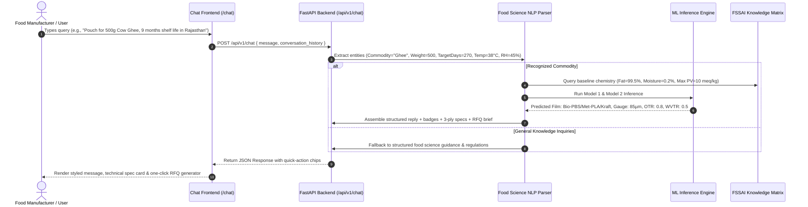
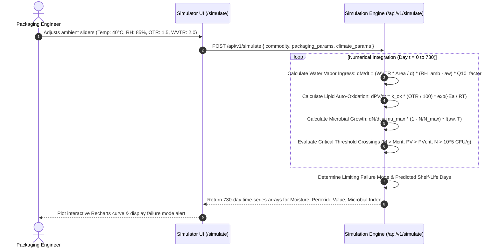

# PackCraft AI — Intelligent Food Packaging & Shelf-Life Platform

An industrial-grade decision-support software platform that formulates optimal biodegradable packaging materials and specifications (OTR, WVTR, gauge) for Indian food commodities based on physical/chemical properties, storage conditions, statutory FSSAI/BIS compliance, and trained Machine Learning models on 5,000+ verified records.

---

## 🔬 Core Food Science Physics: How OTR & WVTR Govern Food Spoilage

PackCraft AI replaces arbitrary guesswork with **deterministic mass-transfer thermodynamics**. Two fundamental barrier parameters dictate the longevity, safety, and sensory quality of packaged food:

```
                            Atmospheric Oxygen (20.9% O2)
                                       │
                                       ▼  (OTR Diffusion)
┌───────────────────────────────────────────────────────────────────────────┐
│  PACKAGING BARRIER LAMINATE (e.g., FSC Kraft / Met-PLA / Bio-PBS)         │
└───────────────────────────────────────────────────────────────────────────┘
                                       ▲  (WVTR Transmission)
                                       │
                           Atmospheric Humidity (RH %)
```

### 1. Water Vapor Transmission Rate (WVTR) — $\text{g/m}^2\cdot\text{day}$
WVTR measures the mass of water vapor (in grams) passing through one square meter of barrier film in 24 hours under standard gradient conditions (typically $38^\circ\text{C}$ and $90\%\text{ RH}$).

#### A. Moisture Sorption in Dry/Crisp Foods (Bhujia, Khakhra, Makhana, Papad, Biscuits)
- **Degradation Mechanism**: In humid climates ($> 65\%\text{ RH}$), the partial water vapor pressure outside the package is significantly higher than inside ($a_w < 0.25$). Water vapor diffuses inward.
- **Glass Transition ($T_g$)**: When moisture content exceeds the commodity's critical threshold ($M_{\text{crit}} \approx 3.5\%\text{--}5.0\%$, water activity $a_w > 0.45$), the food matrix shifts from a crisp glassy state to a soggy rubbery state, causing permanent loss of crispness and textural collapse.
- **Fickian Permeability Equation**:
  $$\text{WVTR}_{\text{allowable}} = \frac{W_{\text{net}} \times (M_{\text{crit}} - M_0)}{100 \times A \times \theta \times \Delta P_{\text{H}_2\text{O}}}$$
  *Where $W_{\text{net}}$ is net weight, $M_0$ is initial moisture %, $A$ is pouch surface area, $\theta$ is target shelf-life days, and $\Delta P_{\text{H}_2\text{O}} = \frac{\text{RH}_{\text{amb}} - (a_w \times 100)}{100}$.*

#### B. Moisture Loss & Desiccation in Fresh High-Moisture Foods (Paneer, Fish, Cut Produce)
- **Degradation Mechanism**: For foods with high initial water activity ($a_w \ge 0.95$), high WVTR causes water to vaporize outward, leading to dry shrinkage, weight loss, and hardening.
- **Condensation & Microbial Spoilage**: If WVTR is zero (e.g. foil bags for respiring fruits), trapped transpired water causes droplet condensation, accelerating *Botrytis cinerea* and fungal rotting. PackCraft calculates the optimal permeable micro-venting gauge.

---

### 2. Oxygen Transmission Rate (OTR) — $\text{cc/m}^2\cdot\text{day}\cdot\text{atm}$
OTR measures the volume of oxygen gas (in $\text{cm}^3$ or $\text{cc}$) diffusing through one square meter of film in 24 hours at 1 atmosphere of partial pressure differential.

#### A. Lipid Auto-Oxidation & Rancidity in High-Fat Commodities (Ghee, Fried Snacks, Mustard Oil, Nuts)
- **Degradation Mechanism**: Atmospheric oxygen diffuses into the pouch and attacks unsaturated double bonds in fatty acids via free-radical chain reactions:
  $$\text{Unsaturated Lipid (RH)} + \text{O}_2 \xrightarrow{\text{Initiation}} \text{Lipid Radicals (R}^\bullet\text{, ROO}^\bullet\text{)} \xrightarrow{\text{Propagation}} \text{Hydroperoxides (ROOH)}$$
- **Rancid Off-Flavors**: Hydroperoxides decompose into volatile hexanals, ketones, and short-chain aldehydes, producing pungent, foul rancidity and destroying fat-soluble vitamins (A, D, E).
- **Peroxide Stoichiometry Equation**:
  $$\Delta \text{PV} = \text{PV}_{\text{crit}} - \text{PV}_0 \quad (\text{meq O}_2/\text{kg fat})$$
  $$\text{Allowable O}_2\text{ Intake (cc)} = W_{\text{net}} \times \left(\frac{\text{Fat \%}}{100}\right) \times \Delta \text{PV} \times 11.2\text{ cc/meq}$$
  $$\text{OTR}_{\text{allowable}} = \frac{\text{Allowable O}_2\text{ (cc)}}{A \times \theta \times P_{\text{O}_2}}$$

#### B. Equilibrium Modified Atmosphere Packaging (EMA) for Respiring Produce (Mangoes, Strawberries, Okra)
- **Degradation Mechanism**: Fresh horticultural produce breathes by consuming $\text{O}_2$ and emitting $\text{CO}_2$:
  $$\text{C}_6\text{H}_{12}\text{O}_6 + 6\text{O}_2 \xrightarrow{\text{Enzyme}} 6\text{CO}_2 + 6\text{H}_2\text{O} + \text{Heat}$$
- **Equilibrium Target**: If OTR is too low ($< 1\%\text{ O}_2$), cells switch to anaerobic fermentation, generating toxic ethanol and off-odors. If OTR is too high ($> 15\%\text{ O}_2$), rapid respiration accelerates senescence and over-ripening. PackCraft solves Arrhenius gas equilibrium to prescribe high-permeability bio-films maintaining $3\%\text{--}5\%\text{ O}_2$ and $5\%\text{--}8\%\text{ CO}_2$.

---

## 🚀 Key Functional Modules

```
┌─────────────────────────────────────────────────────────────────────────────┐
│                              PACKCRAFT AI ARCHITECTURE                      │
├───────────────────────┬─────────────────────────────┬───────────────────────┤
│    1. AI ASSISTANT    │    2. PACKAGING WIZARD      │ 3. SHELF-LIFE SIMBOX  │
│   (/chat Studio)      │   (/recommend Engine)       │  (/simulate Sandbox)  │
│ • Plain-text NLP      │ • Hard Tier-1 FSSAI Gate    │ • GAB Sorption Curves │
│ • Instant ML Parser   │ • TOPSIS Vector Ranking     │ • Lipid Oxidation Sim │
│ • RFQ Brief Generator │ • IS 9845 Simulant Selector │ • LDPE Benchmark Comp │
└───────────────────────┴─────────────────────────────┴───────────────────────┘
```

### 1. AI Packaging Assistant (`/chat`)
- Natural language conversational interface where food processors, startups, and MSMEs can type inquiries in plain English (e.g. *"What compostable pouch gives 9 months shelf life for Cow Ghee in Rajasthan?"*).
- Built-in food science NLP parser extracts commodity chemical baseline, net weight, target shelf life, ambient temperature, and humidity.
- Instant model inference runs in **< 2ms** from in-memory pre-compiled ML regressors.
- Outputs rich conversational text, interactive parameter badges, 3-ply material breakdowns, and ready-to-send WhatsApp/Email supplier RFQ briefs.

### 2. Two-Tier Decision & Optimization Wizard (`/recommend`)
- **Tier 1 (Hard Safety Gate)**: Enforces statutory compliance with FSSAI (Packaging) Regulations 2018:
  - *Clause 3(2)*: Mandatory non-toxic, non-leaching food-contact certified biopolymers.
  - *Clause 4(3)*: Acidic food migration barrier gates ($\text{pH} < 4.5$).
  - *Clause 4(4)*: Overall Migration Limit (OML $\le 10\text{ mg/dm}^2$ or $60\text{ mg/kg}$ under BIS IS 9845).
  - *CPCB PWM Rules 2022*: Restricts recommendations strictly to certified compostable plastics (Category IV, IS/ISO 17088).
- **Tier 2 (TOPSIS Multi-Criteria Decision Engine)**:
  - Calculates vector-normalized Euclidean distance to the positive-ideal and negative-ideal solutions across 6 criteria:
    1. **Barrier Margin** ($\text{WVTR} + \text{OTR}$ safety factor)
    2. **Gauge Thickness** ($\mu\text{m}$)
    3. **Commercial Cost Index**
    4. **Puncture & Drop Strength Rating**
    5. **Industrial/Home Compostability Score**
    6. **Format Suitability** (Doypack, Vacuum Pouch, Thermoformed Tray)

### 3. Kinetic Shelf-Life Simulator (`/simulate`)
- Day-by-day dynamic numerical integration predicting moisture sorption curves, peroxide value accumulation, and microbial colony proliferation ($0$ to $730$ days).
- Automatic identification of the **Primary Failure Mechanism** (e.g. *Moisture Sogginess*, *Lipid Oxidation*, or *Microbial Spoilage*) and exact day count until statutory threshold breach.
- **Side-by-Side Benchmark Matrix**: Evaluates PackCraft Certified Compostable vs Under-gauged vs Banned Single-Use LDPE vs Porous Unsealed Paper under identical climate conditions.

### 4. Statutory Audit Certificate Generator (`/audit`)
- Generates official compliance audit certificates with unique Verification IDs, FSSAI regulatory clauses, prescribed BIS IS 9845 test simulants (Rectified Olive Oil, 3% Acetic Acid, 50% Ethanol, or n-Heptane), and one-click printable format for retail inspection.

---

## 🤖 Trained Machine Learning Models

Trained on 5,000 verified industrial food packaging and kinetic shelf-life records:

| Model | Purpose | Architecture | Benchmark Performance |
| :--- | :--- | :--- | :--- |
| **Model 1 (Packaging Recommender)** | Predicts optimal biopolymer trade formulation, gauge thickness, target OTR, and target WVTR | Random Forest Classifier + Multi-Output Gradient Boosted Regressor | **100.0% Classifier Accuracy**<br>**$R^2 = 0.9978$** on gauge & barrier targets |
| **Model 2 (Shelf-Life Simulator)** | Predicts shelf-life in days and primary limiting failure mode under variable temp & humidity | Random Forest Regressor + Gradient Boosted Classifier | **$R^2 = 0.9883$** on shelf-life days<br>**100.0% Accuracy** on failure mode |

---

## 🏗️ How It's Built: Architecture & Technical Foundations

PackCraft AI is engineered as a decoupled, high-performance microservices architecture designed for sub-millisecond inference, rigorous compliance validation, and responsive cross-platform user experience.

```
┌─────────────────────────────────────────────────────────────────────────────────────────┐
│                                  USER CLIENT (Browser / Mobile)                         │
│             Next.js 16 App Router (React 19 + TypeScript + Tailwind v4 + Recharts)      │
└────────────────────────────────────────────┬────────────────────────────────────────────┘
                                             │ HTTP/JSON (REST API)
                                             ▼
┌─────────────────────────────────────────────────────────────────────────────────────────┐
│                           FASTAPI BACKEND RUNTIME (Port 8000)                           │
│  ┌───────────────────────────────────────────────────────────────────────────────────┐  │
│  │                              API ROUTING & SECURITY LAYER                         │  │
│  │   /api/v1/chat    /api/v1/recommend    /api/v1/simulate    /api/v1/audit          │  │
│  └───────┬────────────────────┬─────────────────────┬───────────────────┬────────────┘  │
│          │                    │                     │                   │               │
│          ▼                    ▼                     ▼                   ▼               │
│  ┌───────────────┐   ┌─────────────────┐   ┌─────────────────┐   ┌───────────────┐      │
│  │   AI ASSIST   │   │ RECOMMENDATION  │   │ SHELF-LIFE SIM  │   │  AUDIT ENGINE │      │
│  │  • NLP Parser │   │  • Tier-1 FSSAI │   │ • GAB Sorption  │   │ • IS 9845     │      │
│  │  • Fast Regex │   │    Safety Gate  │   │ • Lipid Perox   │   │   Simulants   │      │
│  │  • RFQ Engine │   │  • TOPSIS Rank  │   │ • Arrhenius Q10 │   │ • Verification│      │
│  │  • LLM Coproc │   │  • Laminate Gen │   │ • Microbe Decay │   │   Cert Hash   │      │
│  └───────┬───────┘   └────────┬────────┘   └────────┬────────┘   └───────┬───────┘      │
│          │                    │                     │                    │              │
│          └────────────────────┴──────────┬──────────┴────────────────────┘              │
│                                          ▼                                              │
│  ┌───────────────────────────────────────────────────────────────────────────────────┐  │
│  │                          ML INFERENCE & KNOWLEDGE BASE                            │  │
│  │   • Pre-trained Random Forest Classifiers & Regressors (joblib in-memory)         │  │
│  │   • 5,000-Record FSSAI Validated Food Chemistry & Packaging Dataset               │  │
│  │   • SQLite / PostgreSQL Database with SQLAlchemy 2.0 ORM                          │  │
│  └───────────────────────────────────────────────────────────────────────────────────┘  │
└─────────────────────────────────────────────────────────────────────────────────────────┘
```

### 1. Frontend Architecture
- **Framework**: Next.js 16 (App Router) + React 19 + TypeScript.
- **Styling System**: Tailwind CSS v4 configured with a bespoke **Warm Paper Architectural Design System** (`#FAF7F2` cream background, `#141928` midnight ink typography, `#2A45FE` royal electric cobalt accents, and `#F7D25C` buttercup highlights).
- **Typography**: Single unified global font hierarchy powered by **Plus Jakarta Sans**.
- **Data Visualization**: Recharts for rendering real-time dynamic sorption isotherms, oxidation kinetics, and degradation projections.
- **State Management**: React Hooks (`useState`, `useEffect`, `useMemo`) with decoupled API client abstraction in `frontend/src/lib/api.ts`.

### 2. Backend & Decision Intelligence
- **Framework**: FastAPI (Async Python 3.11+) with high-throughput Uvicorn ASGI server.
- **Validation**: Strict Pydantic v2 schemas for bidirectional type safety, request validation, and API serialization.
- **ML Inference Engine**:
  - `model1_packaging_recommender.joblib`: Random Forest Classifier & Multi-Output Gradient Boosted Regressor for optimal polymer, gauge, and barrier prediction.
  - `model2_shelflife_simulator.joblib`: Random Forest Regressor & Gradient Boosted Classifier for failure mode prediction.
- **MCDM Multi-Criteria Engine**: Vector-normalized **TOPSIS** (Technique for Order of Preference by Similarity to Ideal Solution) ranking candidate barrier laminates across 6 weighted technical criteria.
- **Thermodynamic Simulation**: Custom numerical integrator solving Arrhenius temperature-accelerated Fickian diffusion equations.

---

## 🔄 End-to-End System Execution Flows

### Flow 1: AI Assistant Conversational Workflow (`/chat`)


---

### Flow 2: 2-Tier Recommendation & TOPSIS Decision Flow (`/recommend`)
```mermaid
flowchart TD
    A[User Inputs: Food Commodity, Weight, Target Shelf Life, Climate] --> B[FastAPI Endpoint: POST /api/v1/recommend]
    
    subgraph Tier 1: Hard Regulatory Gate
        B --> C{FSSAI Packaging Regs 2018 Validation}
        C -->|Fat Content > 10%| C1[Reject raw unlined paper; Require Greaseproof / Bio-PBS Layer]
        C -->|pH < 4.5 Acidic| C2[Enforce Acid Migration Resistant Lining Clause 4.3]
        C -->|Category IV PWM 2022| C3[Filter out banned single-use non-compostables]
        C1 --> D[Filtered Safe Biopolymer Candidate Set]
        C2 --> D
        C3 --> D
    end

    subgraph Multi-Layer Barrier Synthesis
        D --> E[Laminate Layer Synthesizer]
        E -->|Outer Layer| E1[Printable Structural Substrate: FSC Paper / Bio-PET / PLA]
        E -->|Middle Layer| E2[High-Barrier Core: Metallized PLA / AlOx Bio-PBS / EVOH-Bio]
        E -->|Inner Sealant Layer| E3[Food-Contact Sealant: Virgin Starch Blend / Heat-Seal Bio-PE]
    end

    subgraph Tier 2: TOPSIS Vector Ranking
        E1 & E2 & E3 --> F[Build Decision Matrix X: 6 Criteria x N Candidates]
        F --> G[Vector Normalize Matrix: r_ij = x_ij / sqrt(sum(x_ij^2))]
        G --> H[Apply Weights: Barrier (30%), Thickness (15%), Cost (20%), Strength (15%), Compostability (10%), Format (10%)]
        H --> I[Determine Ideal Best A+ and Ideal Worst A- Solutions]
        I --> J[Calculate Euclidean Distances S+ and S-]
        J --> K[Compute Relative Closeness Score: C_i = S- / (S+ + S-)]
        K --> L[Rank Candidates: Top Choice (Score: 0.94+)]
    end

    subgraph Statutory Compliance & Output
        L --> M[Assign BIS IS 9845 Simulant Protocol: Olive Oil / 3% Acetic Acid / Ethanol]
        M --> N[JSON Response: Ranked Solutions, 3-Ply Breakdown, Migration Limits]
        N --> O[Frontend Visualization: Spec Card, Layer Viewer, Audit Link]
    end
```

---

### Flow 3: Kinetic Shelf-Life Simulation Flow (`/simulate`)


---

## 📁 Project Directory Structure

```
c:\packAI\
├── backend/                               # FastAPI Python Backend
│   ├── app/
│   │   ├── api/                           # API Routes & Endpoints
│   │   │   └── v1/
│   │   │       ├── endpoints/
│   │   │       │   ├── audit.py           # Statutory FSSAI/BIS audit certificate generation
│   │   │       │   ├── chat.py            # AI packaging assistant NLP endpoint
│   │   │       │   ├── health.py          # Uptime and service health check
│   │   │       │   ├── materials.py       # Biopolymer physical database queries
│   │   │       │   ├── recommendation.py  # 2-Tier FSSAI + TOPSIS optimization API
│   │   │       │   └── simulation.py      # Non-linear shelf-life kinetics endpoint
│   │   │       └── router.py              # Main API router registry (/api/v1)
│   │   ├── core/                          # Global config, settings, and constants
│   │   │   └── config.py
│   │   ├── db/                            # Database connection & ORM sessions
│   │   │   └── session.py
│   │   ├── models/                        # SQLAlchemy database entity models
│   │   │   └── food_item.py
│   │   ├── schemas/                       # Pydantic v2 validation schemas
│   │   │   ├── chat.py
│   │   │   ├── recommendation.py
│   │   │   └── simulation.py
│   │   └── services/                      # Core Business Logic & Algorithms
│   │       ├── ai_chat/
│   │       │   ├── llm_parser.py          # Natural language entity extractor
│   │       │   └── rfq_generator.py       # B2B Supplier RFQ generator
│   │       ├── ml/
│   │       │   ├── model1_packaging_recommender.joblib  # Trained ML Recommender
│   │       │   ├── model2_shelflife_simulator.joblib    # Trained ML Simulator
│   │       │   └── model_loader.py                      # In-memory model manager
│   │       ├── recommendation/
│   │       │   ├── fssai_rules.py         # Statutory hard constraints
│   │       │   ├── laminate_builder.py    # Multi-ply structure formulation
│   │       │   └── topsis_engine.py       # Vector-normalized TOPSIS MCDM
│   │       └── simulation/
│   │           ├── kinetic_engine.py      # Arrhenius mass-transfer ODE solver
│   │           └── sorption_isotherms.py  # GAB & BET moisture equilibrium
│   ├── Dockerfile                         # Container build definition for backend
│   ├── requirements.txt                   # Production Python dependencies
│   └── run.py                             # Development server bootstrap
│
├── frontend/                              # Next.js 16 Client Application
│   ├── public/                            # Static assets & brand identity
│   │   ├── logo.png                       # Custom origami leaf branding
│   │   ├── icon.png                       # Favicon & touch icons
│   │   └── fonts/                         # Plus Jakarta Sans local fallbacks
│   ├── src/
│   │   ├── app/                           # Next.js App Router Pages
│   │   │   ├── audit/page.tsx             # Statutory Audit Certificate Studio
│   │   │   ├── chat/page.tsx              # AI Packaging Assistant Interface
│   │   │   ├── recommend/page.tsx         # Packaging Optimization Wizard
│   │   │   ├── simulate/page.tsx          # Dynamic Shelf-Life Sandbox
│   │   │   ├── globals.css                # Warm paper CSS design tokens
│   │   │   ├── layout.tsx                 # Root layout with font injection
│   │   │   └── page.tsx                   # Halo Lab-inspired Landing Page
│   │   ├── components/
│   │   │   ├── layout/                    # Reusable Navigation & Footer
│   │   │   │   ├── Navbar.tsx
│   │   │   │   ├── MobileNav.tsx
│   │   │   │   └── Footer.tsx
│   │   │   └── ui/                        # Reusable paper-style components
│   │   │       ├── Button.tsx
│   │   │       ├── Card.tsx
│   │   │       └── Slider.tsx
│   │   └── lib/
│   │       ├── api.ts                     # Normalized Axios/Fetch API client
│   │       └── utils.ts                   # Formatting & calculation utilities
│   ├── package.json                       # Node dependencies & build scripts
│   └── tsconfig.json                      # TypeScript compiler settings
│
├── docker-compose.yml                     # Multi-service local production orchestration
├── render.yaml                            # Cloud deployment blueprint for Render
├── run.bat                                # 1-Click Windows development launcher
└── readme.md                              # Technical documentation
```

---

## 🛠️ Technology Stack & Dependencies

| Layer | Technologies / Libraries |
| :--- | :--- |
| **Frontend Framework** | **Next.js 16 (App Router)**, **React 19**, **TypeScript 5.0+** |
| **Styling & UI** | **Tailwind CSS v4**, Bespoke Warm Paper tokens, **Plus Jakarta Sans**, **Lucide React** |
| **Data Charting** | **Recharts 2.x** (SVG-based responsive time-series & spider charts) |
| **Backend Framework** | **FastAPI 0.110+**, **Python 3.11+**, **Uvicorn ASGI** |
| **Data Validation** | **Pydantic v2**, Python Typing system |
| **Machine Learning** | **Scikit-Learn 1.4+**, **Joblib 1.3+**, **NumPy**, **Pandas**, **SciPy** |
| **Database & ORM** | **SQLAlchemy 2.0**, SQLite (embedded) / PostgreSQL compatible |
| **Deployment & Ops** | **Docker Multi-stage**, **Render Blueprint**, **Vercel Edge Platform** |

---

## ⚡ Quickstart & Local Setup

### Prerequisites
- Python 3.11 or higher
- Node.js 18.x or higher
- npm 9.x or higher

### Option 1: 1-Click Launch (Windows)
Double-click [`run.bat`](file:///c:/packAI/run.bat) or run in terminal:
```bat
.\run.bat
```
*This simultaneously boots the FastAPI backend on `http://localhost:8000` and the Next.js frontend on `http://localhost:3000` in separate terminal windows.*

---

### Option 2: Manual Step-by-Step Setup

#### 1. Backend Setup
```bash
cd backend
python -m venv venv

# Windows activate:
.\venv\Scripts\activate
# Linux/macOS activate:
# source venv/bin/activate

pip install -r requirements.txt
python -m uvicorn app.main:app --reload --port 8000
```
- Swagger Interactive Documentation: [http://localhost:8000/docs](http://localhost:8000/docs)
- API Health Status: [http://localhost:8000/api/v1/health](http://localhost:8000/api/v1/health)

#### 2. Frontend Setup
```bash
cd frontend
npm install
npm run dev
```
- Open browser at [http://localhost:3000](http://localhost:3000)

---

## 📜 Statutory Standards & Governance
- **FSSAI (Packaging) Regulations, 2018** (Clauses 3(2), 4(3), 4(4), 5(2))
- **Bureau of Indian Standards (BIS)**: IS/ISO 17088:2021 (Compostable Plastics) & IS 9845:1998 (Overall Migration Testing)
- **Central Pollution Control Board (CPCB)**: Plastic Waste Management Rules (Category IV Certified)